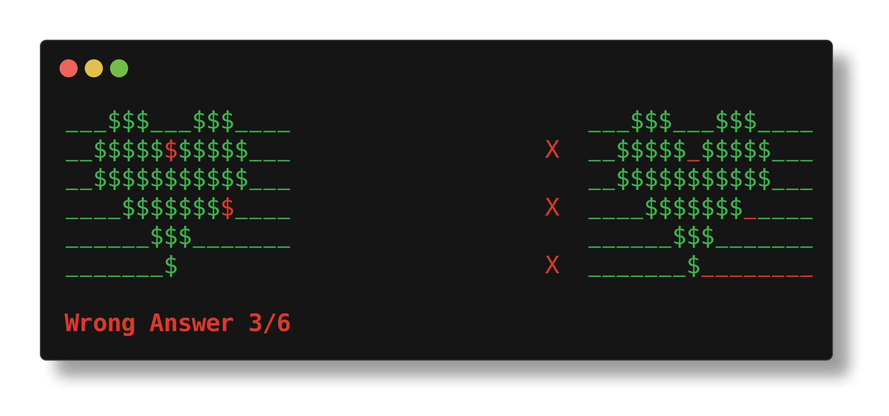

# cpdiff

## Installation

```sh
go install github.com/ChrisVilches/cpdiff@latest
```

## Screenshots

Comparing each number individually. Numbers are allowed to have an error.


Comparing strings. Each character is compared individually.



If you want to compare binary strings (or digits), you can compare them character by character instead of comparing their numeric value.


Big numbers are supported. Numbers can have arbitrary precision or amount of digits.


### Arch Linux (AUR)

```sh
yay -S cpdiff
```

## Development

Linting and formatting:

```sh
go fmt ./...
revive --formatter stylish ./...
```

In order to run tests, first build the project, then set the environment variable below to the path of the executable:

```sh
go build
INTEGRATION_TEST_EXECUTABLE=/path/cpdiff go test ./...
```

Verify installation command works:

```sh
IMG=cpdiff-install-test

docker build -t $IMG .
docker run --rm $IMG
```

Clean up manually afterwards (i.e. remove images).
